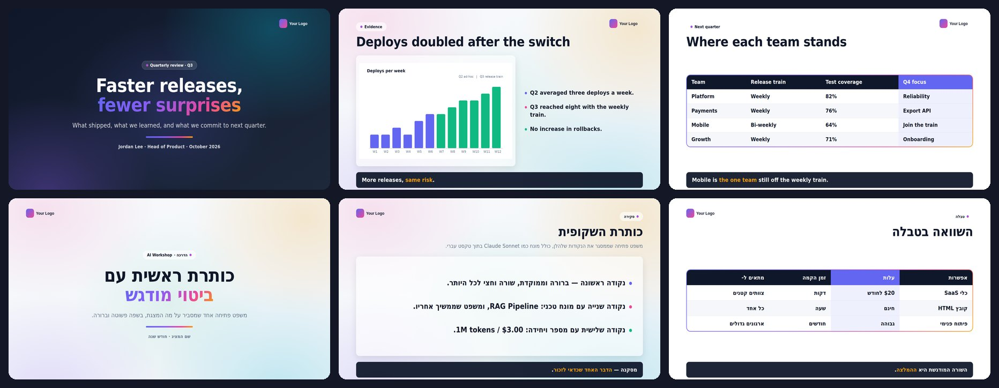
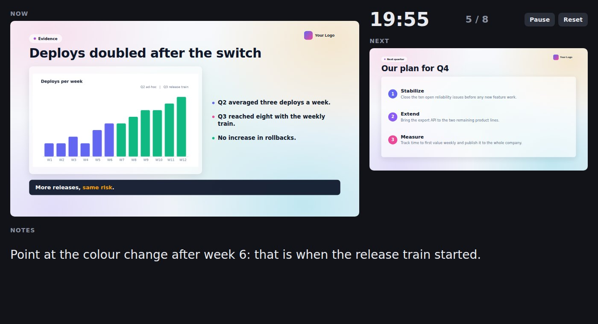

# Presentation Skill

[](https://github.com/Amitro123/Presentation-skill/releases/latest) [](https://github.com/Amitro123/Presentation-skill/actions/workflows/validate.yml) [](LICENSE)

**Out of time, out of tokens, and the layout keeps breaking? Build the deck as a single HTML file.**

You have a presentation to deliver in an hour. The design tool has used up your credits. The slide editor will not keep right-to-left text in order. This project gives you a third option: a finished, large-screen presentation template, and an AI skill that fills it from your documents — in one file, with no account, no subscription and no software to install.



*Slides from [`examples/quarterly-review`](examples/quarterly-review.html) (English) and [`examples/hebrew-example`](examples/hebrew-example.html) (Hebrew, right-to-left), each built from a short JSON content file.*

## Why this approach

- **It is just a file.** One `.html` file opens in any browser, works offline and can be copied to a USB stick, emailed or hosted anywhere.
- **It is easy to change.** Every color, the font, the logo and its position, the language and text direction, the slide count and even the skill's own rules are settings you can override — by hand, in a short configuration file, or simply by asking Claude.
- **Right-to-left is built in.** Hebrew, Arabic and other RTL languages mirror the layout, logo slot, arrow keys and swipe direction automatically. See [`examples/hebrew-example.html`](examples/hebrew-example.html).
- **Made for large screens.** A fixed 1920×1080 canvas scales to any display. Text is sized for reading from across a room and grows when a slide has less to say, so short slides still fill the screen.
- **Cheap to iterate.** An assistant writes a few kilobytes of content, not a whole page of HTML, and a script assembles the deck. Fixing a slide means editing a few lines of text.
- **Presenter view.** Speaker notes per slide, hidden from the audience and the PDF. Press `N` for a second window with notes, the next slide and a timer — put it on your laptop while the deck runs on the TV.
- **Checks itself.** A built-in checklist and an automated audit catch overflow, missing images, broken navigation and PDF problems before you walk on stage.

### What to expect

This is not a one-click generator. A first draft from a good brief is usually close, and two or three short iterations ("shorten slide 4", "make the cover dark", "swap these two sections") bring it to a finished state. The skill is designed so that those iterations are fast and inexpensive.

## Quick start

**With an AI assistant (recommended).** [Install the skill](#install) and ask for a presentation. Claude asks who the audience is, how many slides you need and whether to show the presenter's name, then asks for your source documents and builds the deck. Details below.

**From a content file.** Write the words as a small JSON file and build the HTML with `node skills/html-presentation/scripts/build-deck.js my-deck.json` — see [`examples/quarterly-review.json`](examples/quarterly-review.json). This is what the AI skill does, and it is the cheapest way to produce a deck.

**By hand.**

```bash
cp skills/html-presentation/assets/template.html my-talk.html
open my-talk.html        # or double-click it
```

Replace the slides inside `<div id="deck">`. Navigation, progress dots and the counter update automatically.

| Key / gesture | Action |
|---|---|
| `→` / `Space` / `PageDown` | Next slide (arrow direction follows the reading direction) |
| `←` / `PageUp` | Previous slide |
| `Home` / `End` | First / last slide |
| `F` | Toggle fullscreen |
| `T` | Start / pause the timer (click the timer pill too; double-click resets) |
| `N` | Presenter view: current and next slide, speaker notes, timer (second window; keys there drive the deck) |
| Swipe | Next / previous |

## Presenter view

Add `"notes"` to any slide in the content file. Notes never appear on the slide or in the PDF. Press `N` during the presentation to open a second window — drag it to your laptop screen while the deck runs on the TV:



*The current slide, the next one, the timer and this slide's notes. Keys pressed in this window move the deck on the big screen. Works in right-to-left decks too.*

### Timer

A small timer sits next to the slide counter. Click it (or press `T`) to start or pause, double-click to reset. Set `"duration": 45` in the content file's `meta` and it counts down, turns red for the last few minutes and shows overtime as `+01:30`; without a duration it simply counts up. The presenter view shows the same timer.

## Install

The skill is self-contained: instructions, references, scripts and the template all live in [`skills/html-presentation/`](skills/html-presentation/SKILL.md).

**Claude Code — plugin (recommended)**

```bash
/plugin marketplace add Amitro123/Presentation-skill
/plugin install html-presentation@presentation-skill
```

Or from a local clone: `claude --plugin-dir ./plugin` to try it for one session, `claude plugin install ./plugin --scope user` to keep it.

**Claude Desktop / Cowork** — download [`html-presentation.skill`](https://github.com/Amitro123/Presentation-skill/releases/latest/download/html-presentation.skill) (always the latest release), then *Plugins → Install from file* (or *Settings → Skills*).

**Copy the folder**

```bash
cp -r skills/html-presentation ~/.claude/skills/          # all projects
cp -r skills/html-presentation .claude/skills/            # this project only
```

Requirements: Node 16+ to build decks. Optional: Playwright + Chromium for the audit (`npm i -D playwright`), and `pip install pillow numpy` for logo preparation.

`plugin/skills/` and `html-presentation.skill` are generated from `skills/html-presentation/` by `python3 tools/package_skill.py`; never edit them directly.

## Using the AI skill

```
skills/html-presentation/
├── SKILL.md                      # workflow and rules
├── scripts/
│   ├── build-deck.js             # content file (JSON) → finished deck
│   ├── audit-deck.js             # automated audit + contact sheet (Playwright)
│   └── prepare-logo.py           # any logo image → transparent PNG
├── assets/
│   ├── template.html             # the design system; also the by-hand starter
│   └── template-sample.json      # source of the template's example slides
└── references/
    ├── content-format.md         # JSON format for build-deck.js (default build path)
    ├── design-system.md          # tokens, modes, components, known traps
    ├── slide-templates.md        # copy-paste HTML for hand-written slides
    ├── technical-patterns.md     # pipelines, cost tables, security/architecture slides
    └── verification-checker.md   # checklist and self-repair runbook
```

### How a session goes

1. You ask for a presentation.
2. Claude asks three questions before building anything:
   - who the audience is and what they should do afterwards;
   - how many slides you need;
   - whether the presenter's name should appear on the cover, and what it is.
3. You answer, then attach whatever source material you like — documents, PDFs, notes, data, links, images — or state that there is none.
4. Claude writes a short content file, builds the deck with `build-deck.js`, audits it, looks at one contact-sheet image of all slides, and fixes what it finds.
5. You refine it in plain language.

Questions already answered in your first message, or set in `assets/brand.md` (`audience`, `author`, `slides`), are not asked again.

### Keep your best result as a reference

When you are satisfied with a deck, save it as a reference for the next ones. Claude then matches its design (layout choices, which modes go where, density, spacing) and its language (tone, terminology, headline style) instead of starting from the generic template.

- Copy the file to `assets/references/decks/`, or tell Claude *"save this as a reference deck"*.
- Optionally add notes to `assets/brand.md`, for example *"formal tone, headlines under eight words, dark cover"*.
- With several references, Claude names the one it will follow and you may choose another.

A reference deck guides style only; its content is never copied, and your explicit instructions always take precedence.

## Making it yours

Nothing is fixed. Colors, font, logo, logo position, language, slide counts, density limits and the skill's reference files are defaults.

**Ask Claude.** Place brand material in [`assets/`](assets/README.md) — a logo, a palette or style screenshot, a brand guide, fonts — and say *"Adapt this project to the assets I added."* Claude reads them, chooses a palette, sets the logo and updates the template, then reports what changed.

**Write a short configuration.** Copy [`assets/brand.example.md`](assets/brand.example.md) to `assets/brand.md` and set only what you care about: colors, font, `logo_position`, `slides`, `max_bullets`, `emoji`, which reference files to use, which checks to skip. Anything omitted keeps its default.

**Edit by hand.** Everything lives in the `:root` block of the deck (or `meta.tokens` in a content file):

```css
--c1 … --c6, --ink, --bg, --font      /* theme */
--logo, --logo-dark, --logo-w/-h      /* logo image and size */
```
```html
<div id="deck" data-logo="top-end">  <!-- top-end | top-start | top-center | bottom-start | bottom-end | bottom-center | none -->
```

`start` and `end` follow the reading direction, so the logo mirrors automatically in RTL decks.

**Replace the skill's rules.** The skill's rules live in `skills/html-presentation/references/`. To change them without editing the skill, put files in `assets/references/`: a file with the same name replaces the default, a new file is added. Order of precedence: your request → `assets/brand.md` → `assets/references/` → skill defaults.

## Design in one minute

- **Canvas:** fixed 1920×1080, scaled to fit any screen.
- **Three visual modes**, one per slide:
  - `aurora` — light, soft gradients; the default for reading content.
  - `dark` — deep background with colored glow; covers, dividers, strong statements.
  - `clean-bordered` — white with a gradient frame (`.accent-border`); tables and data.
- **Slide types** (content files): cover, section, statement, bullets, cards, compare, steps, stats, image, table, closing, and `raw` for anything else. Images keep their proportions — a phone screenshot gets a narrow column that fills the height, and a wide chart gets a frame that fits it exactly, never running into the takeaway strip.
- **Components:** `.glass` and `.inkcard` surfaces, `.eyebrow` label, `.title` / `.sub`, `.take` takeaway strip, `.numchip`, bars, big numbers, `.dtable` tables, `.media` image frames.
- **Language:** English and left-to-right by default. For RTL languages set `<html dir="rtl" lang="…">` and change the font.

Full reference: [`docs/design-system.md`](docs/design-system.md) and [`docs/guidelines.md`](docs/guidelines.md), including guidance for TVs and projectors.

## Export to PDF

Open the deck in Chrome → `Ctrl/Cmd + P` → Destination *Save as PDF*, Layout *Landscape*, Margins *None*, enable *Background graphics*. You get one page per slide.

## Audit your deck

`scripts/audit-deck.js` opens a deck in Chromium and checks what a script can check: JavaScript errors, broken images and missing `alt`, keyboard navigation, reduced-motion and print rules, offline safety, RTL term isolation, text size for large screens, overflow on every slide at several screen sizes, large empty areas, content running under the takeaway strip, and that PDF export gives one page per slide. `--sheet=sheet.png` also writes one image with every slide, for a quick visual check.

```bash
npm i -D playwright
node skills/html-presentation/scripts/audit-deck.js examples/hebrew-example.html --sheet=sheet.png
```

It also works on single-file decks not built from this template, as long as slides are `.page` or `.slide` elements and the visible one has `.active`. It exits with code 1 on any failure, so it can run in CI. CI in this repository runs the builder's unit tests and [`html-validate`](https://html-validate.org), and checks that the examples match their content files and that the packaged skill and plugin are up to date.

## Project layout

```
.
├── skills/html-presentation/   # the skill — single source of truth (see above)
├── plugin/                     # Claude Code plugin, generated (skills/) + plugin.json
├── .claude-plugin/             # marketplace.json, so the repo can be added as a plugin marketplace
├── html-presentation.skill     # zip for Claude Desktop / Cowork, generated
├── examples/                   # quarterly-review (LTR) and hebrew-example (RTL): content .json + built .html
├── assets/                     # your logo, brand.md, references/, images (see assets/README.md)
├── docs/                       # design system, authoring guidelines, README images
├── tests/                      # unit tests for the deck builder (npm test)
├── tools/
│   ├── package_skill.py        # builds plugin/ and the .skill file
│   └── release_notes.py        # prints a version's section of CHANGELOG.md
├── CHANGELOG.md                # release notes, one section per version
└── .github/workflows/          # tests and validation on push / PR; releases
```

## Contributing

Issues and pull requests are welcome. Before opening a pull request:

```bash
npm test                  # builder unit tests (no dependencies)
npm run validate          # html-validate on the template and examples
npm run audit             # browser audit (needs Playwright + Chromium)
npm run build:examples    # regenerate examples/*.html from their .json files
npm run package           # regenerate plugin/skills/ and html-presentation.skill
```

Edit only `skills/html-presentation/` and the example `.json` files; everything else is generated, and CI fails if it is stale. A change to the builder comes with a test in `tests/build-deck.test.js`. Contributor rules are in [`CLAUDE.md`](CLAUDE.md).

**Releasing:** bump the version in `plugin/.claude-plugin/plugin.json`, add a `## vX.Y.Z` section to [`CHANGELOG.md`](CHANGELOG.md), then push a `vX.Y.Z` tag — or, from any browser, *Actions → Release → Run workflow* with the version. The workflow creates the tag and the GitHub release with the `.skill` file and the changelog section as notes; running it again for an existing version updates them.

## License

[MIT](LICENSE)
